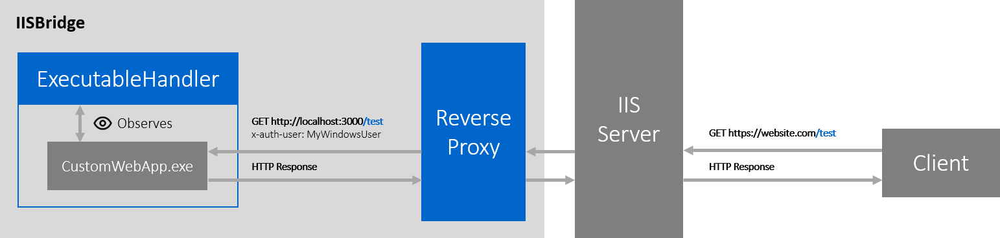

# IISBridge

This is a simple ASP.NET Core app for hosting any web application on a IIS server.
It was originally created to host node.js applications on IIS with Windows Auth because there were some issues with [iisnode](https://github.com/Azure/iisnode) and Windows Authentication.



* **ExecutableHandler**: This component ensures that the web application executable is always up and running. It starts the executable with configuration provided within `Web.config`.

* **ReverseProxy**: Proxies requests from IIS to the port which the web app executable is running on and returns the response. It additionally adds the HTTP-Header `x-auth-user` with the current user who was authenticated with Windows Auth by the IIS server.

## Build

*Be sure that .NET Core is installed on your computer*

Run the following command within the root directory:
```
dotnet publish -c Release
```

This will create a new directory `bin\Release\netcoreapp2.2\publish`.
You need `iisbridge.dll`, `iisbridge.runtimeconfig.json` and `web.config` to run your application later.

## Setup

1. Ensure the [ASP.NET Core Hosting Module](https://docs.microsoft.com/en-us/aspnet/core/host-and-deploy/iis/?view=aspnetcore-2.2#install-the-net-core-hosting-bundle) is installed on your server.

2. Copy `iisbridge.dll`, `iisbridge.runtimeconfig.json` and `web.config` into the directory of your web application (which you want to run on iis) and configure iisbridge for your application within `web.config`:

*The following example shows how to run a node application on iis:*
```xml
<?xml version="1.0" encoding="utf-8"?>
<configuration>
  <appSettings>
    <appProcessName>node.exe</appProcessName>
    <appProcessArgs>test/index.js</appProcessArgs>
    <appProcessEnv>NODE_ENV=testing</appProcessEnv>
    <appProcessPort>3000</appProcessPort>
  </appSettings>
  <system.webServer>
    <handlers>
      <add name="aspNetCore" path="*" verb="*" modules="AspNetCoreModuleV2" resourceType="Unspecified" />
    </handlers>
    <aspNetCore processPath="dotnet" arguments=".\iisbridge.dll" stdoutLogEnabled="false" stdoutLogFile=".\logs\stdout" hostingModel="InProcess" />
  </system.webServer>
</configuration>
```

It is very important to provide the port `appProcessPort` which the application is running on. So the iisbridge's reverse proxy knows where to redirect the requests.
It is also possible to provide some environment variables or process start arguments `appProcessArgs`.

3. If you want to use Windows Authentication within your application, be sure that `Windows Authentication` is enabled and `Anonymous Authentication` is disabled on your server.

## Troubleshooting

If something is not working like expected, it is recommended to set `stdoutLogEnabled` to `true` which will log the stdout of your web application executable. There you should be able to figure out any problem really fast.